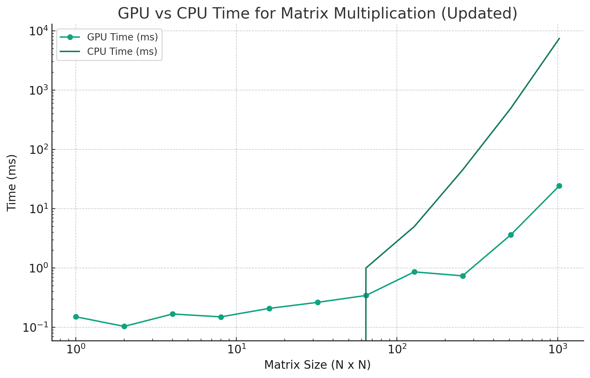

#  Cuda-matrix-multiplication

This is a simple example of matrix multiplication using CUDA. CPU and GPU runtime are compared.
Here is a graph of the runtime comparison on my machine:

My PC has a Ryzen 9 AMD Ryzen 9 6900HS and a RTX 3070 ti. The graph shows that the GPU runtime is much faster than the CPU runtime after a certain size.

# Blog post
I wrote a blog post about this project. You can find it [here](https://enzoberry.fr/posts/leveraging_gpu/).
